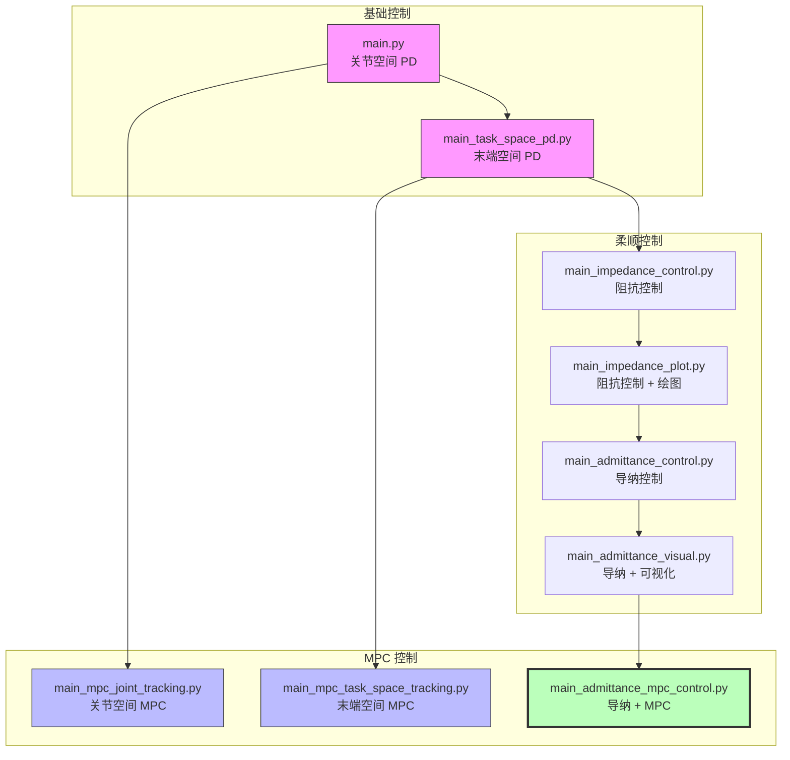
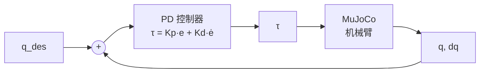
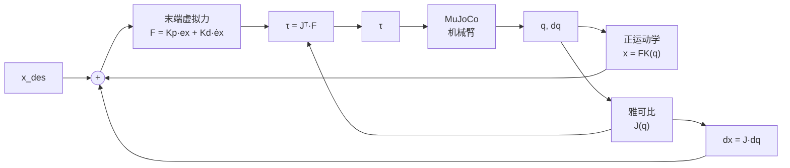
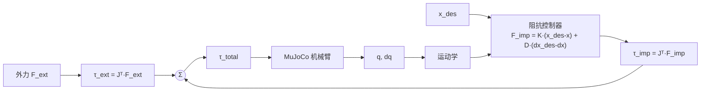
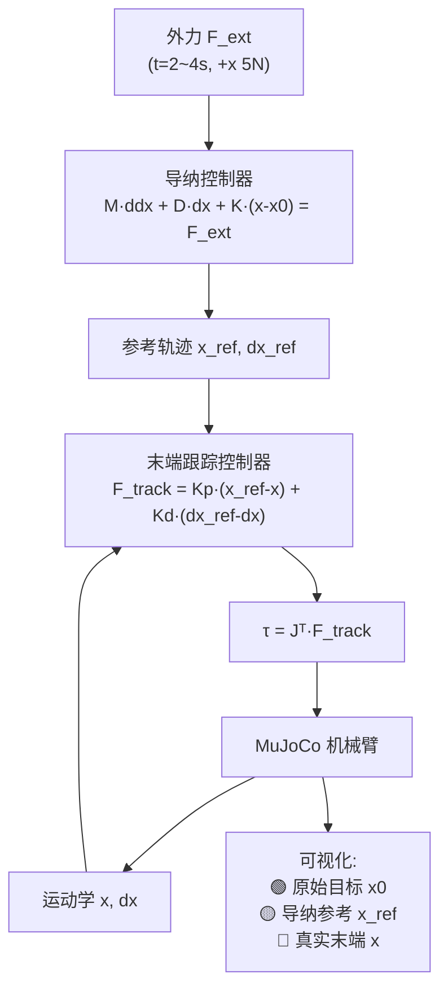
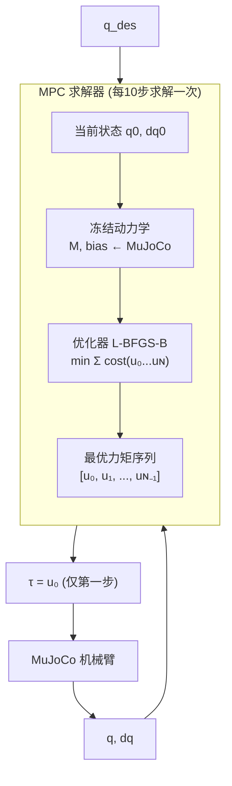
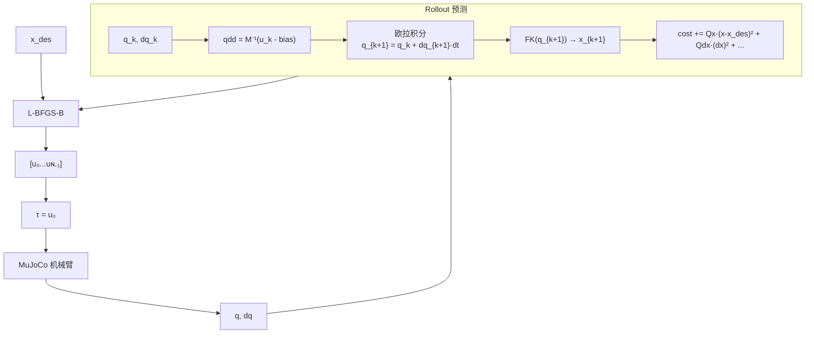
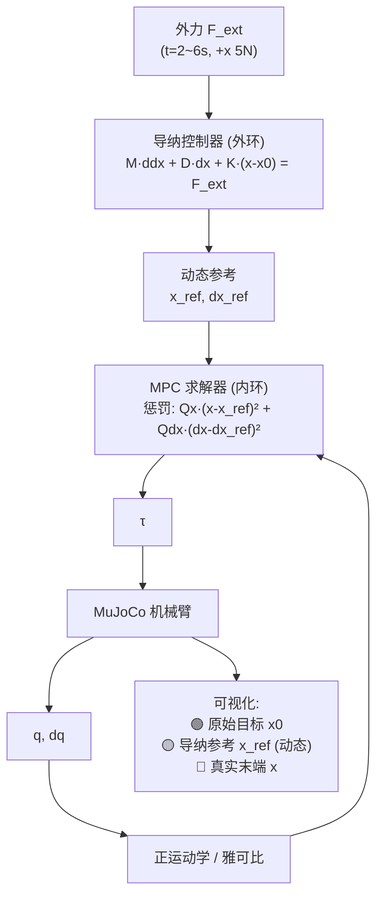
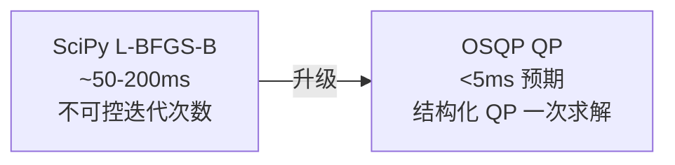

# Arm Admittance MPC — 二自由度机械臂柔顺控制与 MPC

基于 MuJoCo 物理引擎的二自由度平面机械臂控制系统，由浅入深实现了 PD 控制、阻抗/导纳柔顺控制，以及关节空间/末端空间的模型预测控制（MPC）。项目面向机械臂力控交互场景，可向真实机械臂（Franka、KUKA、UR 等）延展部署。

---

## 项目结构

```
.
├── kinematics.py                          # 正运动学 & 雅可比矩阵
├── models/
│   └── two_link_arm.xml                   # MuJoCo 二自由度机械臂模型
├── main.py                                # 1. 关节空间 PD 控制
├── main_task_space_pd.py                  # 2. 末端空间 PD 控制
├── main_impedance_control.py              # 3. 阻抗控制（交互仿真）
├── main_impedance_plot.py                 # 4. 阻抗控制 + 数据记录绘图
├── main_admittance_control.py             # 5. 导纳控制 + 末端 PD 跟踪
├── main_admittance_visual.py              # 6. 导纳控制 + 三色点可视化
├── main_mpc_joint_tracking.py             # 7. 关节空间 MPC
├── main_mpc_task_space_tracking.py        # 8. 末端空间 MPC
├── main_admittance_mpc_control.py         # 9. 导纳 + MPC（SciPy L-BFGS-B）
├── main_admittance_mpc_osqp_control.py    # 10. 导纳 + OSQP-MPC (QP 求解)
├── main_compare_mpc.py                    # 11. SciPy vs OSQP 对比实验
├── requirements.txt                       # Python 依赖
├── docs/
│   └── OSQP_MPC_UPDATE.md                 # OSQP MPC 详细文档
└── results/                               # 求解统计 CSV 输出目录
```

---

## 机械臂模型

```
         y ↑
           │
           │     L2 = 0.4m
           │   ╭──────────╮  ● ee_site (红色末端)
           │  ╱            ╲
           │ ╱ q2           ╲
           │╱                ╲
           ○──── L1 = 0.5m ────○
          ╱ q1                 base (0, 0)
         ╱
        ● base
```

| 参数 | 值 |
|------|-----|
| 杆 1 长度 L1 | 0.5 m |
| 杆 2 长度 L2 | 0.4 m |
| 关节数 | 2 (旋转关节) |
| 驱动力矩范围 | ±20 N·m |
| 仿真步长 | 0.002 s |

MuJoCo 可视化中的三个标记点：
- 🔴 **红色点** `ee_site`：真实末端执行器位置
- 🟢 **绿色点** `target_site`：原始固定目标位置
- 🟡 **黄色点** `admittance_ref_site`：导纳控制器生成的动态参考位置

---

## 控制架构总览



---

## 控制方法详解

### 1. 关节空间 PD 控制 — [main.py](main.py)

最简单的闭环控制：给定目标关节角度 q_des，用 PD 控制器计算力矩。



数学形式：

$$\tau = K_p (q_{\text{des}} - q) + K_d (\dot{q}_{\text{des}} - \dot{q})$$

### 2. 末端空间 PD 控制 — [main_task_space_pd.py](main_task_space_pd.py)

直接在末端任务空间做 PD 控制：误差在 Cartesian 空间计算，用雅可比转置将末端虚拟力映射为关节力矩。



核心关系：

$$\begin{aligned}
x &= FK(q) \\
\dot{x} &= J(q) \cdot \dot{q} \\
F &= K_p (x_{\text{des}} - x) + K_d (\dot{x}_{\text{des}} - \dot{x}) \\
\tau &= J(q)^T \cdot F
\end{aligned}$$

### 3. 阻抗控制 — [main_impedance_control.py](main_impedance_control.py) / [main_impedance_plot.py](main_impedance_plot.py)

给定目标末端位置 x_des，机械臂末端对外表现为一个**弹簧-阻尼系统**。外力 F_ext 直接作用在末端上，阻抗控制器产生回复力。



### 4. 导纳控制 — [main_admittance_control.py](main_admittance_control.py) / [main_admittance_visual.py](main_admittance_visual.py)

导纳控制与阻抗控制的**对偶关系**：

| | 阻抗控制 | 导纳控制 |
|---|---|---|
| 输入 | 位置 → 输出力 | 力 → 输出位置 |
| 适用场景 | 低刚度环境 | 高刚度环境 / 自由空间 |
| 外环 | — | 导纳模型生成 x_ref |
| 内环 | — | 位置跟踪控制器跟踪 x_ref |



导纳微分方程：

$$M \ddot{x}_{\text{ref}} + D \dot{x}_{\text{ref}} + K (x_{\text{ref}} - x_0) = F_{\text{ext}}$$

- **M** (虚拟质量): 越大，响应越慢
- **D** (虚拟阻尼): 越大，越不易振荡
- **K** (虚拟刚度): 越大，系统越"硬"，偏移越小

### 5. 关节空间 MPC — [main_mpc_joint_tracking.py](main_mpc_joint_tracking.py)

用模型预测控制替代 PD 控制器，在约束条件下优化未来 N 步力矩序列。



MPC 代价函数：

$$\min_{u_0,\dots,u_{N-1}} \sum_{k=0}^{N-1} \left[ Q_q (q_k - q_{\text{des}})^2 + Q_{\dot{q}} \dot{q}_k^2 + R u_k^2 \right] + Q_{q,\text{term}} (q_N - q_{\text{des}})^2$$

约束：$u_k \in [\tau_{\text{min}}, \tau_{\text{max}}], \quad \forall k$

关键技术点：
- **冻结动力学**：在预测窗口内固定质量矩阵 M 和偏置项 bias，降低计算复杂度
- **Warm start**：用上一轮优化结果偏移后作为本轮初值，加速收敛
- **滚动时域**：每次只执行第一步力矩，下一周期重新优化

### 6. 末端空间 MPC — [main_mpc_task_space_tracking.py](main_mpc_task_space_tracking.py)

将 MPC 的代价函数定义在末端 Cartesian 空间，直接优化末端位置误差。



代价函数（末端空间）：

$$\min_{u_0,\dots,u_{N-1}} \sum_{k=0}^{N-1} \left[ Q_x \|x_k - x_{\text{des}}\|^2 + Q_{\dot{x}} \|\dot{x}_k\|^2 + Q_{\dot{q}} \|\dot{q}_k\|^2 + R \|u_k\|^2 \right] + Q_{x,\text{term}} \|x_N - x_{\text{des}}\|^2$$

### 7. 导纳 + MPC（终极组合）— [main_admittance_mpc_control.py](main_admittance_mpc_control.py)

将导纳控制作为**外环**（力 → 参考轨迹），MPC 作为**内环**（轨迹跟踪），结合两者优势：



| 对比 | 导纳 + PD | 导纳 + MPC |
|------|-----------|------------|
| 内环跟踪器 | PD (固定增益) | MPC (优化求解) |
| 力矩约束 | 后置 clip | 优化内嵌约束 |
| 动态性能 | 依赖调参 | 预测优化，更优 |
| 计算量 | 低 | 中等 |

### 8. 导纳 + OSQP-MPC — [main_admittance_mpc_osqp_control.py](main_admittance_mpc_osqp_control.py)

将内环 MPC 从 SciPy L-BFGS-B 通用优化替换为结构化 QP 求解器 OSQP，大幅提升求解速度和可预测性。



核心变化：
- **线性化 FK**：用 $J(q_0)$ 将末端误差映射为 $q$ 的二次型，使代价函数严格为 QP
- **稀疏 QP 构造**：构建 $P, q, A_{\text{cons}}, l, u$ 直接用 OSQP 求解
- **显式约束**：力矩/关节角/关节速度限位直接编码在 QP 约束中
- **Δu 平滑**：新增力矩变化率惩罚项
- **求解统计**：记录每次求解时间、状态、迭代次数，输出 CSV

运行对比：
```bash
python main_admittance_mpc_osqp_control.py   # OSQP 版本
python main_compare_mpc.py                   # SciPy vs OSQP 对比
```

详见 [docs/OSQP_MPC_UPDATE.md](docs/OSQP_MPC_UPDATE.md)。

---

## 控制方法对比

| 方法 | 文件 | 控制空间 | 核心思想 |
|------|------|----------|----------|
| 关节 PD | `main.py` | 关节空间 | 直接跟踪 q_des |
| 末端 PD | `main_task_space_pd.py` | 末端空间 | Cartesian 误差 → Jᵀ 映射 |
| 阻抗控制 | `main_impedance_control.py` | 末端空间 | 机械臂 = 弹簧-阻尼系统 |
| 导纳控制 | `main_admittance_*.py` | 末端空间 | 外力 → 参考轨迹 → 跟踪 |
| 关节 MPC | `main_mpc_joint_tracking.py` | 关节空间 | 预测优化，约束力矩 |
| 末端 MPC | `main_mpc_task_space_tracking.py` | 末端空间 | Cartesian 代价 + 预测优化 |
| **导纳+MPC** | `main_admittance_mpc_control.py` | 末端空间 | **导纳外环 + MPC 内环** |
| **导纳+OSQP-MPC** | `main_admittance_mpc_osqp_control.py` | 末端空间 | **QP 结构化求解，实时可部署** |

---

## 环境配置与运行

### 依赖

```bash
conda create -n robot_lab python=3.10
conda activate robot_lab
pip install mujoco numpy scipy matplotlib osqp
```

### 运行

```bash
# 基础控制
python main.py                          # 关节空间 PD
python main_task_space_pd.py            # 末端空间 PD

# 柔顺控制
python main_impedance_control.py        # 阻抗控制
python main_impedance_plot.py           # 阻抗控制 + 绘图
python main_admittance_control.py       # 导纳控制 + PD
python main_admittance_visual.py        # 导纳控制 + 可视化

# MPC
python main_mpc_joint_tracking.py       # 关节空间 MPC
python main_mpc_task_space_tracking.py  # 末端空间 MPC

# 终极组合
python main_admittance_mpc_control.py       # 导纳 + MPC (SciPy)
python main_admittance_mpc_osqp_control.py  # 导纳 + OSQP-MPC

# 对比实验
python main_compare_mpc.py                  # SciPy vs OSQP 对比
```

每个脚本运行后会自动打开 MuJoCo viewer，仿真结束后弹出 matplotlib 绘图窗口。

---

## 关键技术细节

### 冻结动力学 (Frozen Dynamics)

MPC 预测需要积分动力学。为简化计算，在每个 MPC 求解周期内从 MuJoCo 提取当前质量矩阵 M 和偏置项 bias，在预测窗口内假设不变：

$$M(q_{\text{current}}) \cdot \ddot{q} + b(q_{\text{current}}, \dot{q}_{\text{current}}) = \tau$$

### Warm Start

上一轮优化得到力矩序列 $[u_0, u_1, ..., u_{N-1}]$。本轮已执行 $u_0$，将序列左移一位：

$$[u_1, u_2, ..., u_{N-1}, u_{N-1}]$$

作为本轮优化的初始猜测，显著减少迭代次数。

### 正运动学

二自由度平面机械臂：

$$\begin{aligned}
x &= L_1 \cos(q_1) + L_2 \cos(q_1 + q_2) \\
y &= L_1 \sin(q_1) + L_2 \sin(q_1 + q_2)
\end{aligned}$$

### 雅可比矩阵

$$J(q) = \begin{bmatrix}
-L_1 \sin q_1 - L_2 \sin(q_1+q_2) & -L_2 \sin(q_1+q_2) \\
L_1 \cos q_1 + L_2 \cos(q_1+q_2) & L_2 \cos(q_1+q_2)
\end{bmatrix}$$

满足 $\dot{x} = J(q) \cdot \dot{q}$，以及 $\tau = J(q)^T \cdot F$。

---

## 向真实机械臂延展

当前项目基于 MuJoCo 仿真，控制框架与真实机械臂对接时需关注以下要点：

### 架构映射

```
仿真环境                          真实机械臂
─────────                        ─────────
MuJoCo model/data    ──→    libfranka / RTDE / ROS2 control
mujoco.mj_step()     ──→    机械臂控制循环 (1kHz)
data.qpos / data.qvel ──→   关节编码器 / 速度估计
data.ctrl[:] = tau   ──→    关节力矩指令 (需 torque interface)
data.site_xpos       ──→    正运动学计算 (无需仿真)
```

### 适配清单

1. **运动学模块** `kinematics.py`：直接复用，FK 和 Jacobian 公式与真实机械臂一致（需更新 DH 参数）
2. **阻抗/导纳控制**：控制律为数学公式，直接可移植到真实控制器
3. **MPC 模块**：需要：
   - 替换 `get_frozen_dynamics()` 为真实机械臂的刚体动力学模型（可用 Pinocchio、RBDL 等）
   - 将 `scipy.optimize.minimize` 替换为实时 QP 求解器（qpOASES、OSQP、HPIPM）
   - 调整预测步长 $dt$ 以匹配真实控制频率
4. **力矩接口**：需要机械臂支持力矩控制模式（torque interface），而非位置/速度接口

### 推荐技术栈（真实机械臂）

| 组件 | 推荐 |
|------|------|
| 运动学/动力学 | Pinocchio |
| QP 求解器 | OSQP / qpOASES |
| 通信中间件 | ROS2 + ros2_control |
| 机械臂驱动 | libfranka (Franka) / RTDE (UR) |
| 实时控制 | Xenomai / PREEMPT_RT |

---

## 参考

- MuJoCo Documentation: https://mujoco.readthedocs.io/
- Siciliano, B. et al. "Robotics: Modelling, Planning and Control"
- Rawlings, J.B. et al. "Model Predictive Control: Theory, Computation, and Design"
